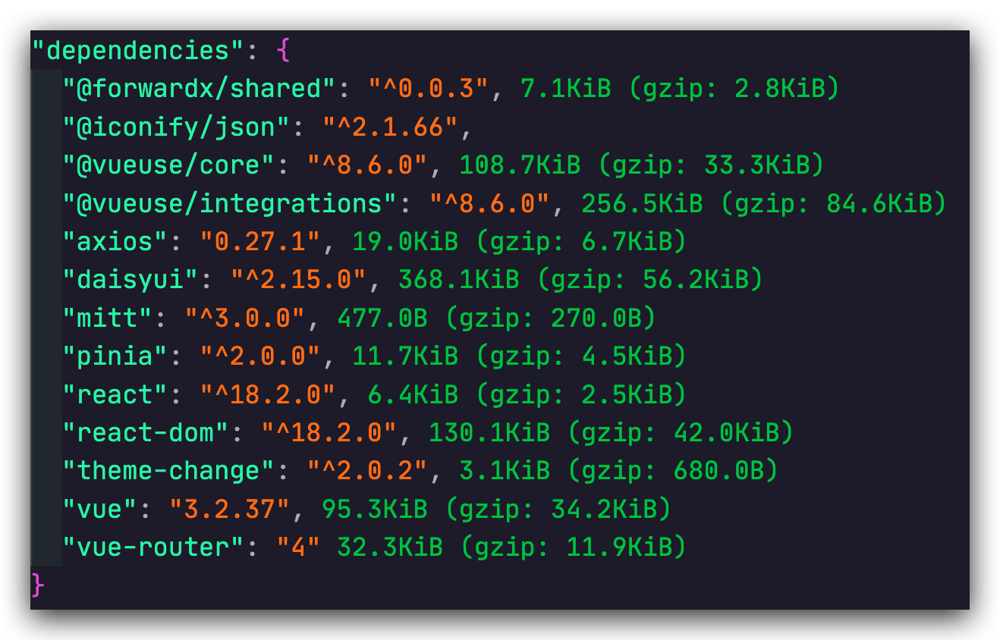
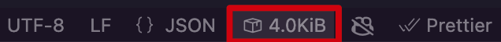

Language : [🇺🇸 English](./README.md) | 🇨🇳 简体中文

<h1 align="center">PKG Size</h1>

<div align="center">


</div>

## 概括

`PKG Size` 是一个统计 `package.json` 中依赖项 size 的 VSCode 插件 📦

## 特点

- 打包完之后 size
- gzip 压缩后 size
- 在底部状态栏显示当前文件大小
- 构建结果缓存

## 图示

`package.json`


状态栏



## 使用说明

### 清除**当前** project 缓存

***点击状态栏图标***即可清除构建缓存

或者

```bash
# 打开命令选项板 (Command/Ctrl + Shift + P)
Rebuild Deps
```

> 只会清除当前 project 所使用到的依赖缓存(如果有的话)

### 清除**所有**缓存

- `Linux` and `MacOS`: `rm -f ～/.pkg.size`
- `Windows`: 删除 `C:\Users\YouName\.pkg.size`

## 常见问题

### 一些依赖不会被构建

带有特定 loader 的依赖不会被构建

### 能否自建后端

可以

1. 部署后端请看 [bundlephobia](https://github.com/pastelsky/bundlephobia)

2. 修改配置文件 `${home}/.pkg-size` 的 `baseUrl`

```json
{
    "configs":{
        "baseUrl": "https://youdomain"
    }
}
```

### 能否自行实现后端

可以

```bash
GET /api/size/package=port-seletor@0.1.5

# return
data: {
    size: string
    gzip: string
}
```

## 发行说明

查看 [CHANGELOG](CHANGELOG.md)

## 路线图

以下是我想要实现或正在开发的功能:

- [ ] 计算依赖大小的之和
- [ ] 添加控制 status bar 显示或者隐藏的命令

## 感谢

<a href="https://www.flaticon.com/free-icons/package" title="package icons">Package icons created by IconBaandar - Flaticon</a>

构建信息来自 [bundlephobia](https://bundlephobia.com/)
